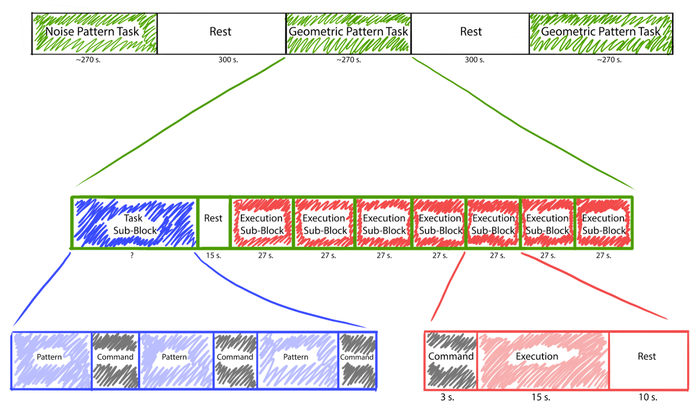

# EEG-Experiment-Script
This script is used to generate a visual stimuli (pictures/images) for EEG semantic reconstruction of image experiment. It also could run the constructed experiments in real time with previous preprocessing to decrease the time delays and make the experiment unbiased.


## Installation And Run
1. Download the repository using `git clone https://github.com/Leon-Parepko/EEG-Experiment-Script.git`.
2. Install the required packages using `pip install -r requirements.txt`.
3. Run the script using `python run.py` with `-c` for CLI mode (preferred) or `-g` for GUI mode.
4. Follow the instructions in the CLI/GUI.
5. To test the appropriate work of the software you could run predefined `Content/test_long.json` file.

## Common Usage
1. Configure manually geometric patterns in `geometric_patterns.txt` by adding or modifying matrices where 0 is white and 1 is black.
2. Launch the script as written above and generate the experiment using corresponding option. It would automatically generate the experiment (sequence of blocks - `.json` file) based on a structure shown on a picture below (from experiment protocol) and entered timings.
3. Run the experiment by specifying the path to recently constructed `.json` file.
4. Wait for the experiment preprocessing and start it by pressing enter when the individual would be ready.


## Custom Experiment
If you want to create your own experiment, you should follow the structure presented in `Content/test_short.json` and create or modify manually new experiment file. The basic block structure is following:
```
  "Unique_Block_Name": {
    "type": "pattern" / "command" / "execution" / "rest" / "custom",
    "content": {
      "duration": 1
      ...
      ...
    }
```


## Warnings
* Do not use laptop with multiple monitors connected to it. It would cause the experiment to be run on the wrong resolution, so the physical scale would be wrong too.
* Specify geometric patterns before launching the software.
* Save the generated experiment files. Each time it is generated it uses random seeds to make the experiments different and unbiased for each subject.
* Check the structure of custom generated experiment files. If the block is not specified correctly, it would be skipped.
* If you want to use custom blocks, you should specify images only in `.png` format.